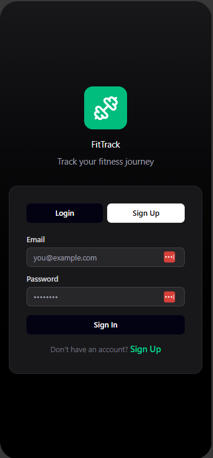
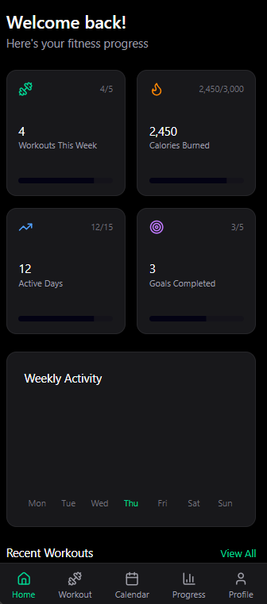
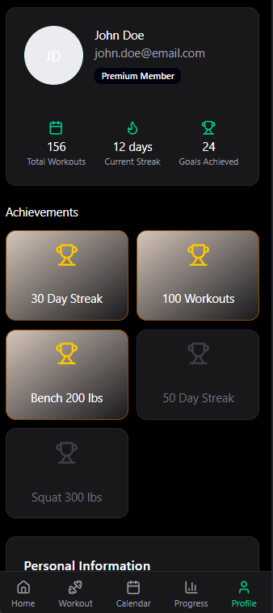
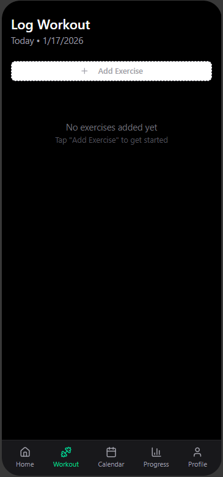
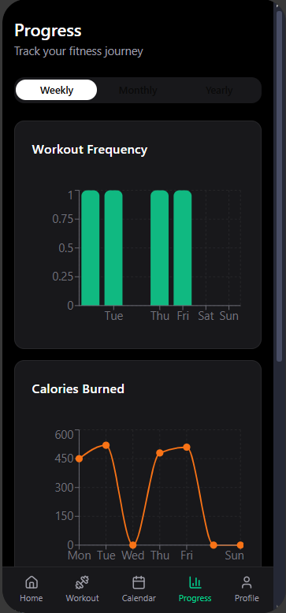

# FitnessTracker (Expo App)

 **Status: Under Active Development** 

FitnessTracker is a React Native (Expo) mobile application focused on **workout logging and progress tracking** for gym-goers. The app is being actively developed with an emphasis on clean UI, flexible workout tracking, and long-term scalability.

This project is currently in the **development phase**, and features, UI, and architecture are subject to change as development continues.

 **Development started:** November 11, 2025  
 **Development status:** Ongoing

## 📱 App Prototype

### Login Screen


### Home Screen


### Profile Screen


### Edit Profile Screen


### Workout Screen


### Progress Screen


### Calendar Screen


---

## 🚀 Get Started

### 1. Install dependencies
```bash
npm install
```

### 2. Start the app
```bash
npx expo start
```
